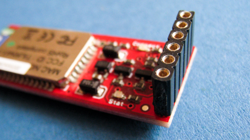

**Building an AHRS using the SparkFun "9DOF Razor IMU" or "9DOF Sensor Stick"**  
Razor AHRS v1.4.1 &mdash; *See the [Changelog](Changelog)*

**Contents**
* [Intro](Tutorial#intro)
* [Setting up the hardware](Tutorial#setting-up-the-hardware)
* [Setting up the software](Tutorial#setting-up-the-software)
* [Testing the tracker](Tutorial#testing-the-tracker)
* [Sensor calibration](Tutorial#sensor-calibration)
* [Using the tracker](Tutorial#using-the-tracker)
* [Writing your own code to read from the tracker](Tutorial#writing-your-own-code-to-read-from-the-tracker)
* [Mathematical background and firmware internals](Tutorial#mathematical-background-and-firmware-internals)

Intro
-----

**This tutorial** describes how to put together an *Attitude and Heading Reference System* (AHRS) which does not cost much (around 140$/120€) and works very well. It can be used in projects requiring real-time 3D orientation tracking such as
* Robots
* UAVs and autonomous vehicles
* Image stabilization systems
* Head-tracking, e.g. for binaural audio applications (the [SoundScapeRenderer](https://dev.qu.tu-berlin.de/projects/ssr) - a spatial audio reproduction tool - has *Razor AHRS* support built in)

Watch a demo video:

The tutorial will show you how to build a **wired** version of the tracker (connected via **USB**), as well as a **wireless** version (using **Bluetooth**).
Of course it’s also possible to integrate it into your hardware projects directly by connecting to the `RX`/`TX` pins, e.g. using an [Arduino](http://arduino.cc/) board.

This [Razor AHRS Firmware](https://github.com/ptrbrtz/razor-9dof-ahrs) is based on an
[update](http://groups.google.com/group/sf_9dof_ahrs_update/) of the [older AHRS code](http://code.google.com/p/sf9domahrs/) for a previous version of the *Razor* board. That code didn’t get  updated for newer versions of the board, was a little messy (no offense!) and was also lacking some  features I wanted to have and found necessary - e.g. sensor calibration to improve precision - so I extended and partly rewrote it and decided to make it public.

<!-- TODO links to downloads instead of repo? -->
Improvements over the updated _AHRS code_ currently provided by SparkFun include:
* Much better performance due to sensor calibration
* Binary and text output modes
* Serial command interface
* Easy to understand, setup and extend
* Outputs correct angles right after start-up, instead of converging slowly
* [Processing test-sketch](https://github.com/ptrbrtz/razor-9dof-ahrs/tree/master/Processing/Razor_AHRS_test) available
* [C++ library](https://github.com/ptrbrtz/razor-9dof-ahrs/tree/master/C%2B%2B) available for Mac OSX, Unix and Linux
* [Android library](https://github.com/ptrbrtz/razor-9dof-ahrs/tree/master/Android) available for *Android 2.0* and newer

Feedback and contributions welcome!

Setting up the hardware
-----------------------

### 9DOF Razor IMU vs. 9DOF Sensor Stick

 

**NOTE:** This section about setting up the hardware was written for the ***9DOF Razor IMU***. If you’re using the ***9DOF Sensor Stick*** you’ll have to figure out how to set it up yourself, though most things mentioned here can be adapted.

The big difference is that the *Sensor Stick* does not come with a microcontroller on board, so most people will end up connecting it to an [Arduino](http://arduino.cc/), which will run the firmware and do all the communication. With [this older port](http://mbed.org/users/lpetre/programs/RazorAHRS) by Luke Petre it can also be run using [mbed](http://mbed.org/) microcontrollers.

Currently the firmware supports the *9 Degrees of Freedom - Razor IMU* boards with SparkFun product numbers [SEN-10125](http://www.sparkfun.com/products/10125) and [SEN-10736](http://www.sparkfun.com/products/10736) and *9 Degrees of Freedom - Sensor Stick* boards with SparkFun product numbers [SEN-10183] (http://www.sparkfun.com/products/10183), [SEN-10321](http://www.sparkfun.com/products/10321) and [SEN-10724](http://www.sparkfun.com/products/10724).

### What you need

For the **wired** solution (via **USB**) using the ***9DOF Razor IMU*** you need:
* The [9 Degrees of Freedom - Razor IMU](http://www.sparkfun.com/products/10736) board (or compatible).
    * Currently the firmware supports the boards with SparkFun product numbers [SEN-10125](http://www.sparkfun.com/products/10125) and [SEN-10736](http://www.sparkfun.com/products/10736). Older versions are not supported.
* The [FTDI Basic Breakout - 3.3V](http://www.sparkfun.com/products/9873) board (or compatible) and a
*USB mini-B* cable to connect it to your computer.
    * Alternatively using an *FTDI Cable* instead of the breakout board should also work, but be sure to get the 3.3V version.

For the **wireless** solution (using **Bluetooth**) you **additionally**
need:
* A *Bluetooth Modem*. I used the [Bluetooth Mate Gold](http://www.sparkfun.com/products/9358) which is quite expensive. Cheaper ones should work too as long as they support the *Serial Port Profile* (SPP). Almost all modules support *SPP*.
* A *Lithium Polymer* (LiPo or LiPoly) battery to power the whole thing. The battery should be single-cell and thus have 3.7V nominal voltage. Pick a capacity based on your needs. I'm using 400mAh, which
is still pretty small and can power the *Razor* and the *Bluetooth Mate Gold* for about 6 hours. Make sure the battery has an integrated *low-voltage cutoff* circuit to prevent deep discharge. *LiPo* batteries
die if they get discharged too low.
* A *LiPo* charger. I used the SparkFun [USB LiPoly Charger - Single Cell](http://www.sparkfun.com/products/10161) which is cool because it also uses a *USB mini-B* plug and you can charge without having to replug the battery. It is also possible to charge and draw from the battery at the same time.

You will also need soldering equipment and some *pin headers* and *jumper wires* to connect the parts (see next section). You could also use some *stranded wire* and *heat shrink* to make your own custom-lenght *jumper wires*:

&nbsp;&nbsp;&nbsp;&nbsp;

All the links posted point to the US SparkFun site which is a greatplace to look for parts, but in case you don’t live in the States (like me), you might want to find a SparkFun distributor in your country. In Germany [Watterott](http://www.watterott.com/) is a good alternative.

### How to put it together

1. Assembling the **wired** tracker using the ***9DOF Razor IMU*** is pretty simple:

        FTDI BREAKOUT <--> RAZOR
        GND           <--> GND
        CTS           <--> CTS
        3.3V          <--> 3.3V
        TXO           <--> RXI
        RXI           <--> TXO
        DTR           <--> DTR

      
    (The *FTDI Breakout* says 5V, but it’s actually outputting 3.3V - I used the jumper on the backside to change it)

2. Assembling the **wireless** version is also pretty simple:
    * If the plug of your *LiPo battery* does not connect with the connector on your *LiPo charger* you could solder some *pin headers* to the battery and the charger like this:

        
    * Add *pin headers* to power the *Razor* like this:

        
    * If your *Bluetooth Modem* does not have *pin headers* already, add them:

        
    * Use some more *jumper wires* and connect everything. When connecting take care about +/- polarities.
The I/O header layout of the *Bluetooth Mate* also matches the header layout of the *Razor* (connect GND to GND of course), so you can use the same *jumper wire* you used to connect to the *FTDI Breakout*.
If you use a different *Bluetooth modem*, you might have to reorder the wiring.

            BLUETOOTH MATE <--> RAZOR
            GND            <--> GND
            CTS-I          <--> CTS
            VCC            <--> 3.3V
            TX-O           <--> RXI
            RX-I           <--> TXO
            RTS-O          <--> DTR

        
    * **NOTE: Do not solder any wire to the boards directly. Even when using the tracker with *Bluetooth*, you still need the wired USB setup to program it. So you have to be able to plug/unplug connections between the boards.**
    * ***WARNING: When you go from Bluetooth setup to the wired USB setup, make sure you disconnect the battery as well and not just replace the modem with the FTDI connector. You would connect the battery to your computer, which is not a good idea.***
    * By using the little `ON`/`OFF` switch on the board you can completely turn off the tracker to save battery. Charging the battery is always possible, no matter if the board is switched `ON` or `OFF`.

Setting up the software
-----------------------

### What you need

* TODO Download and unzip the latest *Razor AHRS Firmware* package from the [files page](https://dev.qu.tu-berlin.de/projects/sf-razor-9dof-ahrs/files).
* Download and install the [Arduino Software](http://arduino.cc/en/Main/Software). We will use it to     upload the firmware and calibrate the sensors.

### Uploading the firmware

* Even if you want to use *Bluetooth* later on, setup the tracker using *USB* for now (see *[How to put it together](Tutorial#how-to-put-it-together)*) and connect it to your computer. Uploading does not work via *Bluetooth*.
* From your downloaded *Razor AHRS Firmware* package open the file `Arduino/Razor_AHRS/Razor_AHRS.pde` using *Arduino*.
* In *Arduino*:
    * Have a look at the top of the `Razor_AHRS.pde` file, it contains useful information about the firmware.
    * Also there is a section labeled `"USER SETUP AREA"` where you can set some firmware defaults.
        * **You have to select the hardware you are using under `"HARDWARE OPTIONS"`!**
    * Go to `"Tools"` &rarr; `"Board"` and select the board you are using. If you have a *9DOF Razor IMU*, select `"Arduino Pro or Pro Mini (3.3v, 8mhz) w/ATmega328"`.
    * Go to `"Tools"` &rarr; `"Serial Port"` and select the port used with the *Razor*. On Mac OSX this is most likely the first in the list. On Windows/Linux that might be different.
    * Go to `"File"` and hit `"Upload to I/O Board"`. After a short while at the bottom of the *Arduino* code window it should say `"Done uploading"`.

Testing the tracker
-------------------

### Serial Monitor

To test by staring at numbers, bring up the *Serial Monitor* of *Arduino* under `"Tools"` &rarr; `"Serial Monitor"`. Set it to 57600 baud and you should get some output like this:

Go ahead and try the commands listed in `Razor_AHRS.pde` by typing them into the edit box at the top of the *Serial Monitor*. For example you can switch to binary output by sending `#ob` and should see something like  this:

### *Processing* test sketch

You can also use the *Processing* test sketch to test the tracker:

* Download and install [Processing](http://processing.org/). We will use it to compile and run the test program.
    * **NOTE: There seems to be a bug with the serial library in the latest *Processing* versions 1.5 and 1.5.1: "WARNING: RXTX Version mismatch …".** (The previous version 1.2.1 works fine and is still available [here](http://code.google.com/p/processing/downloads/list)).
* TODO From your downloaded [Razor AHRS Firmware](https://dev.qu.tu-berlin.de/projects/sf-razor-9dof-ahrs/files) package open the file `Processing/Razor_AHRS_test/Razor_AHRS_test.pde` using *Processing*.
* In *Processing*:
    * Go to `"Sketch"` and hit `"Run"`.
    * The test sketch should now show the movements of the tracker. If not, have a look at the console at the bottom of the *Processing* code window. It might tell you why it’s not working. Most likely something is wrong with the serial port. At the top of the code you find a description how to set the correct port.

Sensor calibration
------------------

Depending on how good or bad your sensors are, precision and responsiveness of *Razor AHRS* can be improved a lot by calibrating the sensors.  
If not calibrated you may get effects like
* drifts in *yaw* when you apply *roll* to the board.
* pointing *up* does not really result in an *up* attitude.

You have to know that the definition of the axes differs from what is printed on the board.  
The firmware uses
* X axis pointing forward (towards the short edge with the connector holes)
* Y axis pointing to the right
* Z axis pointing down

which gives a right-handed coordinate system.

### Standard calibration

It might be good to power up the *Razor* a few minutes before calibration, so the sensors can warm up.   Calibrating the sensors the first time can be a little tricky, but let’s go:
* Open `Arduino/Razor_AHRS/Razor_AHRS.pde` using *Arduino* and find the section `"USER SETUP AREA"` / `"SENSOR CALIBRATION"`. This is where you put the calibration values later.
* Connect the *Razor AHRS* to your computer, set the correct serial port in *Arduino* and open the *Serial Monitor*.
* If you didn’t change the firmware defaults, you should see lots of output like this:

        #YPR=-155.73,-76.48,-129.51
* Set the firmware **output mode** to **calibration** by sending the string `#oc`. You should now see output like this:

        accel x,y,z (min/max) = -5.00/-1.00  25.00/29.00  225.00/232.00

1. **Calibrating the accelerometer**:
    * We'll try to find the minimum and maximum output values for the earth gravitation on each axis. **When you move the board, move it real slowly, so the acceleration you apply to it is as small as possible.** We only want pure gravity!
    * Take the board and point straight down with the x-axis (remember: x-axis = towards the short edge with the connector holes). While you do that, you can see the x-maximum (the second value) getting bigger.
    * Hold the board very still and reset the measurement by sending `#oc` again.
    * Now carefully tilt the board a little in every direction until the value does not get bigger any more and write down the x-maximum value.
    * Do the same thing for the opposite side (x-axis pointing up) to get the x-minimum: bring into position, send `#oc` to reset measurement, find x-minimum value and write it down.
    * Do the same thing for the z-axis (down and up) and the y-axis (right and left).
        * If you think you messed up the measurement by shaking or moving the board too fast, you can always reset by sending `#oc`.
    * You should now have all the min/max values. Put them into `Razor_AHRS.pde`.
    * **NOTE**: You have to be really careful when doing this! Even slightly tapping the board with the finger messes up the measurement (try it!) and leads to wrong calibration. Use `#oc` very often and double check your min/max values)
2. **Calibrating the magnetometer**:
    * This time you can shake the board as much as you want, but move it away from magnetic distortions introduced by computers and other electronic devices and metal objects.
    * We’re still *calibration mode* for the accelerometer. Send `#on`, which will move calibration to the **next** sensor, which is the magnetometer.
    * **NOTE:** *This section stays here for reference, but you should use the newer "Extended magnetometer calibration (see [next section](Tutorial#extended-magnetometer-calibration)) as it yields much better results! You can skip this and continue with the gyroscope.*
    * We'll try to find the minimum and maximum output values for the earth magnetic field on each axis. This basically works like calibrating the accelerometer, except the magnetic field of the earth does not point down straight. Depending on where on the planet you currently are, it points north-and-up (southern hemisphere) or north-and-down (northern hemisphere) at a certain angle. This angle is called *inclination*. Additionally there might be a tiny deviation from true geographic north, which is called *declination*. See [Wikipedia](http://en.wikipedia.org/wiki/Earth_magnetic_field). The following description assumes you’re calibrating the magnetometer on the northern hemisphere.
    * Hold the board flat like a compass with the x-axis (remember: x-axis = forward, towards the connector holes) pointing north. Then begin to rotate the board around the east-west axis so it starts pointing down. Observe the x-maximum (the second value) in the *Serial Monitor* and you will notice when you aligned the board’s x-axis with the magnetic field of the earth. Stop rotating there and again tilt a little in every direction until the value does not get bigger any more.
    * Do the same thing for the opposite side to get the x-minimum: first point north, then down.
    * For the magnetometer we don’t need to reset with `#oc` between measurements.
    * Do the same thing for the z-axis (up/down) and the y-axis (left/right).
        * NOTE: The rotation of the board **around** the axis you want to measure doesn’t matter, only that it points into the correct direction. E.g when you start measuring the z-axis, it doesn’t matter if the x-axis points up or down or left or right.
    * You should now have something like this in your *Serial Monitor*:

            magn x,y,z (min/max) = -564.00/656.00  -585.00/635.00  -550.00/564.00

        Put these values into `Razor_AHRS.pde`.
3. **Calibrating the gyroscope**:
    * Lay the *Razor* still on the table.
    * We’re still *calibration mode* for the magnetometer. Send `#on`, which will move calibration to the **next** sensor, which is the gyroscope.
    * **Wait for 10 seconds, and do not move the *Razor*.** It will collect and average the noise of the gyroscope on all three axes.
    * You should now have output that looks like this:

            gyro x,y,z (current/average) = -29.00/-27.98  102.00/100.51  -5.00/-5.85
        * If you think you messed up the measurement by shaking or moving the board, you can reset by sending `#oc`.
    * Take the second values of each pair and put them into `Razor_AHRS.pde`.

* Done :)

### Extended magnetometer calibration

The standard magnetometer calibration only compensates for *hard iron* errors, whereas the extended calibration compensates for *hard* and *soft iron* errors. Still, in both cases the source of distortion has to be fixed in the sensor coordinate system, i.e. moving and rotating with the sensor.

* To start calibrating, put the sensor in the magnetic environment where it will be used later - e.g. in the exact spot on your headphones, if you need to to head-tracking for audio applications (headphones have strong magnets, the less you move the sensor after calibrating, the better your results will be; you should also think about putting some dummy material between the ear cups to bring them in normal hearing position).
* Quit all applications that read from the sensor (e.g. *Serial Monitor*, *Processing* test sketch, …) and run the *Processing* magnetometer calibration sketch located in in `Processing/Magnetometer_calibration`. In fact, you have to install the EJML library first, else the sketch won’t run. How to do that? Have a look at the *NOTE* at the top of `Magnetometer_calibration.pde`.
* Try to rotate the sensor in a way so that you cover all orientations so you produce dots that more or less evenly cover the sphere.

* In a mostly undistorted environment this could look something like this:

    

* Hit `SPACE` and watch the *Processing* console - you’ll find some lines of code that you have to put into the firmware under `"USER SETUP AREA"` / `"SENSOR CALIBRATION"` and you’re done.

The collected data (the dots) are also written to a file `magnetom.float` in the sketch folder. Now in case you own Matlab, under `Matlab/magnetometer_calibration` you’ll find a script called `magnetometer_calibration.m` that uses this file and produces some plots for you, so you can visually check the calibration.

Ellipsoid fit and corrected values:

TODO
&nbsp;&nbsp;&nbsp;&nbsp;!{width:480px}Hard_and_Soft_Iron_Calibration_1b.png! !{width:480px}Hard_and_Soft_Iron_Calibration_1c.png!

#### Another calibration example: Soft iron gives a sphere scaled and distorted into an ellipsoid.

* Sampled raw magnetometer values:

    TODO
    !{width:660px}Hard_and_Soft_Iron_Calibration_2a.png!
* Ellipsoid fit and corrected values:

    TODO
    !{width:480px}Hard_and_Soft_Iron_Calibration_2b.png! !width:480px}Hard_and_Soft_Iron_Calibration_2c.png!

#### Another calibration example: Hard iron gives an offset sphere.

* Sampled raw magnetometer values:

    TODO
    !{width:660px}Hard_and_Soft_Iron_Calibration_3a.png!
* Ellipsoid fit and corrected values:

    TODO
    !{width:480px}Hard_and_Soft_Iron_Calibration_3b.png! !{width:480px}Hard_and_Soft_Iron_Calibration_3c.png!

Using the tracker
-----------------

### Commands, modes and start-up defaults

See `Arduino/Razor_AHRS/Razor_AHRS.pde` for a list of commands and modes _Razor AHRS_ understands, as well as other useful information. You can also set some firmware parameters there, e.g. the default output modes.

### Hints and known bugs

* You should avoid magnetic field distortions (e.g. from metal objects and electronic devices nearby).
* In few cases _Razor AHRS_ can become confused (magnetic field distortions?) and starts acting weird. It seems like the magnetometer becomes "locked", resulting in the heading always drifting/converging back to the same angle. Resetting the microcontroller which runs the Razor AHRS firmware does not help in this case (so it's not a firmware bug!), but turning power off and on again should do the trick. I think this must be a bug inside the magnetometer.

### Using the tracker with Bluetooth

One good thing about using the tracker with *Bluetooth* is, that the board will not be reset when you connect (see *[About auto-reset](Tutorial#about-auto-reset)*).

Another good thing is, that synching (see *[About synching](Tutorial#about-synching)*) will happen automatically if `OUTPUT__HAS_RN_BLUETOOTH` is set to `true` in `Arduino/Razor_AHRS/Razor_AHRS.pde`. The first byte you receive after connecting definitely belongs to a new *Razor AHRS* output frame. You don’t have to use that, but it makes life easier.

In order for this to work you have to do some one-time-setup on the *Bluetooth modem*. If you’re using the *Bluetooth Mate* or a compatible module by *Rovering Networks* it works like this:
* Upload the file `Arduino/Configure_BT_Dummy/Configure_BT_Dummy.pde` to the *Razor* via *USB* using the *Arduino Software*.
* Switch the tracker to use *Bluetooth* instead of *USB* (see *[How to put it together](Tutorial#how-to-put-it-together)*) and turn it on using the little `ON`/`OFF` switch on the board.
* Create a virtual serial port for the *Bluetooth modem*. How you do it depends on your OS, on Mac OSX you do via the *Bluetooth Preferences*. The default PIN of the modem very likely is `0000` or `1234`.
* In *Arduino* set the *Serial Port* to the one you just created.
* Switch the *Razor* `OFF` and `ON` again to restart the *Bluetooth modem*.
* Then within the next 60 seconds (LED on the modem blinks fast) fire up the *Serial Monitor*. Make sure the setting at the bottom says `"No line ending"`.
    * On Mac OSX you could also use [ZTerm](http://homepage.mac.com/dalverson/zterm/) to do that. Holding the *shift key* on ZTerm start allows you to select the serial port.
    * When connected hit *CMD+k* to bring up an input field to send text over the serial connection.
* Now (still in the 60 second frame) send `$$$`, which brings the modem into *command mode*.
* Change the *Serial Monitor* from `"No line ending"` to `"Both NL & CR"` (it’s strange, but entering *command mode* while `"Both NL & CR"` is set doesn’t work).
* You can now configure the modem by sending:
     * `SU,57` to set the baudrate to `57600`.
     * `SO,#` to set the prefix for `CONNECT`/`DISCONNECT` messages sent to the *Razor* to `#`.
     * TODO: *Latency and power saving options*
* Send `---` to end configuration
* Change `"Both NL & CR"` back to the default `"No line ending"`.
* Close *Serial Monitor*, switch the tracker back to use *USB* (as mentioned before, make sure you also disconnect the battery before connecting the board to your computer) and upload the *Razor AHRS Firmware* from `Arduino/Razor_AHRS/Razor_AHRS.pde` again.

**NOTE:** These 60 seconds are called ***Config Timer***. Like described above it’s the time frame after power-up in which you can enter *command mode*. I experienced that the modem always drops the connection if you transmit too much data in this kind of "wait mode". This is also the reason why we uploaded `Configure_BT_Dummy.pde`: it has no output.  
This also means that if you’re actually using the tracker, after switching it on you’d have to wait until *Config Timer* is over. You can either wait the full 60 seconds before connecting or change the *Config Timer* to - let’s say 15 seconds - by sending `ST,15` while in *command mode*. Do not make it too short, with 15 seconds you already have to hurry if you want to enter *command mode* next time. Connecting via *Bluetooth* just takes more time than just opening a normal serial port connection.

Keep in mind that *Bluetooth* almost never works full 100% like it should (at least that’s my experience). If you have trouble connecting, switching things off and on again or using another computer with different *Bluetooth* hardware or a different *Bluetooth* stack is definitely worth a try.

### Using the tracker with Bluetooth on Android

There is a library and a test app on how to use *Razor AHRS* with *Android*. TODO Find it on the [files page](http://dev.qu.tu-berlin.de/projects/sf-razor-9dof-ahrs/files).

&nbsp;&nbsp;&nbsp;&nbsp;

Everything said in the [previous section](Tutorial#using-the-tracker-with-bluetooth) of course also applies when using the _Razor_ with _Bluetooth_ on *_Android_*. But _Bluetooth_ seems to be even more picky on _Android_ than it is anyway, so be prepared that it sometimes just won't connect for no apparent reason. Waiting a bit and retrying mostly helps. If not, switch _Bluetooth_ off and on again in the Android system settings and/or reset your _Bluetooth modem_ by power-cycling it. Maybe also wait a bit before trying to connect again, so _Bluetooth_ can do it's magic. How well it actually works really differs from device to device.

On the devices tested it seemed necessary that the _Razor_ is not sending data when not connected (meaning streaming output disabled, _Stat LED_ off). Otherwise connections get reset right away. Most likely this has
something to do with internal buffering. Try this:
* If you have a *Rovering Networks* *Bluetooth modem* (e.g. the *Bluetooth Mate*) you can solve this easily by setting `OUTPUT__HAS_RN_BLUETOOTH` to `true` in the *Razor AHRS Firmware*.
* If you have a different modem, you can still set `OUTPUT__STARTUP_STREAM_ON` to `false` in the firmware, but you’d have to reset the Razor manually if an open *Bluetooth* connection is broken by error, because the *Razor* would remain in streaming output mode after the connection was broken. Keep an eye on the *Stat LED* on the *Razor*: it should be off when *Bluetooth* is not connected.

Other *Android Bluetooth* bugs you **might** see:
* The *Android* *Bluetooth* subsystem floods the log with so many messages that it overflows after a few seconds.
* Canceling while connecting sometimes blocks - although it shouldn’t.
* Android does a kind of "half-connect", so that the connection-LED of the modem lights up, but the app hangs on the connect in a non-cancelable way.
* Trying to connect to an already-connected modem hangs in a non-cancelable way

Writing your own code to read from the tracker
----------------------------------------------

### About synching

When you use the *Razor AHRS* in binary [output mode](Tutorial#commands-modes-and-start-up-defaults) and the board does not auto-reset (see next section) on connect, you can not tell where one output frame (yaw/pitch/roll) ends and the next one starts. That is because you tune in to the stream at a random position. Just send a synch request, e.g. `#s12` to the *Razor* and it will reply with the synch token `#SYNCH12\r\n`. After that starts a new output frame. This mechanism is used in the *Processing* test sketch and the TODO [C++ and Android libraries](https://dev.qu.tu-berlin.de/projects/sf-razor-9dof-ahrs/files).

### About auto-reset

Like most of the *Arduino* boards, the *Razor* has an auto-reset feature, which allows the *Arduino Software* to reset the board via *USB* using the *DTR* line. That way you don’t have to press the reset button every time you upload a program to the board. The dark side of this is, that it will also cause a reset every time software on your computer opens a serial connection to the board via *USB*, thus every time restarting the *Razor AHRS Firmware*. More details about the auto-reset feature can be found [here](http://www.arduino.cc/en/Main/ArduinoBoardProMini) (see section "Automatic Reset").

Auto-reset does not happen when connecting via *Bluetooth*.

Auto-reset is bad, if you want to send commands to the *Razor* right after you connect (most likely because you want to synch and/or set the output mode). Because the on-board *bootloader* is running for a short
time after power-up, your commands will get lost. You have these options:

1. **Always use auto-reset via _USB_** and set up the firmware defaults in `Arduino/Razor_AHRS/Razor_AHRS.pde` so you don’t have to send any commands at all.
    * **Pro**: works with binary and text output.
    * **Con**: relies on hardcoded firmware defaults, relies on auto-reset via *USB*, does not work with *Bluetooth*.

2. **Always disconnect the _DTR_ pin on the board when using _USB_**, so auto-reset does never happen and you can send commands immediately after connect.
    * **Pro**: works with *USB* and *Bluetooth*, no need to rely on firmware defaults.
    * **Con**: you need two cables now: one **with** *DTR* to upload the firmware to the board and one **without** *DTR* to actually use it.

3. **Don’t care if auto-reset happens**, but set up firmware defaults in `Arduino/Razor_AHRS/Razor_AHRS.pde` so you don’t have to send any commands at all. Have to use text output mode.
    * **Pro**: works with *USB* and *Bluetooth*, no need for a second no-DTR cable.
    * **Con**: relies on hardcoded firmware defaults, does not work with (faster) binary output mode.

4. **Don’t care about anything** :)

    In that case you can send commands to set the desired output mode. In case you’re using binary output mode you’d also have to synch. Because there might be a reset, you need to wait until AHRS is up and running and send your commands then, so they won’t get lost. But how to know when it’s up and running?

    The easy way is to wait a long-enough time (3 seconds should be ok) after opening the serial port until you send your commands to the *Razor* (for the sake of simplicity, that is what I did in the *Processing* test sketch).

    The more complicated but much faster way is to send synch requests to the *Razor* in 200ms intervals until it answers. We then know we’re heard and can send our actual commands (to make it work with every
setup, that’s what I did in the TODO [C++ and Android libraries](https://dev.qu.tu-berlin.de/projects/sf-razor-9dof-ahrs/files)).
    * **Pro**: universal: works with *USB* and *Bluetooth*, works with binary and text output mode, no need to rely on any firmware defaults.
    * **Con**: harder to code than the other options.

You see, it’s really a question of which setup(s) you want to support. Even if a little harder to code, 4. might be the best option because it always works.

Mathematical background and firmware internals
----------------------------------------------

### Sensor fusion algorithm

Internally the fusion of accelerometer, magnetometer and gyroscope data is done using a *Direction Cosine Matrix* (DCM) algorithm. The algorithm also takes care of handling sensor noise and numerical errors. It is based on [this paper](http://gentlenav.googlecode.com/files/DCMDraft2.pdf) by William Premerlani. For even more detailed information have a look at [these papers](http://gentlenav.googlecode.com/files/MahonyPapers.zip) by Robert Mahony.

### Sensor calibration

Based on the calibration measurements you compile into the firmware (see *[Sensor calibration](Tutorial#sensor-calibration)*), the firmware tries to compensate all three sensors for:
* wrongly scaled sensor axes: e.g. if the accelerometer x-axis measures 200 units, whereas the accelerometer y-axis measures 230 units with the same force applied. All three axes per sensor should be consistent.
* zero offsets: e.g. if any of the gyroscope axes reports something different than zero when the board is not moving.

Right now these compensations are not adaptive over time. They stay the same and they’re only as good as the calibration measurements you hardcode into the firmware.

The magnetometer has some particularities when it comes to calibration, since there are not only internal sensor inaccuracy and noise, but also external magnetic field distortions. Good magnetometer performance is
most crucial to yield a correct heading in all directions - so if you calibrate in a distorted environment, you will always have errors.

There are several types of magnetic field distortions. First of all there is *soft iron* and *hard iron* distortion. Second, the source(s) of distortion can be relative to the sensor (i.e. moving and rotating
with the sensor) or independent from the sensor (bound to the world or moving independently in the world).  
To learn about *soft iron* and *hard iron* distortion and possible compensation approaches, have a look
[here](http://blogs.freescale.com/2011/03/14/hard-and-soft-iron-magnetic-compensation-explained/), [here](http://www.vectornav.com/index.php?option=com_content&view=article&id=24&Itemid=11) and [here](http://www.sensorsmag.com/sensors/motion-velocity-displacement/compensating-tilt-hard-iron-and-soft-iron-effects-6475).

Currently the calibration compensates for *hard* and *soft iron* errors, where the *iron* moves/rotates with the sensor. Compensating for *hard/soft iron* errors where the source of distortion is not bound to the sensor is only possible to a certain degree and requires quite complex adaptive algorithms. There are no plans on adding compensation for these kinds of errors in the near future.

* * * * *

 This Tutorial is licensed under a [Creative Commons Attribution-NonCommercial-ShareAlike 3.0 Unported License](http://creativecommons.org/licenses/by-nc-sa/3.0/). The code is licensed under [GPLv3](http://www.gnu.org/copyleft/gpl.html).

* * * * *